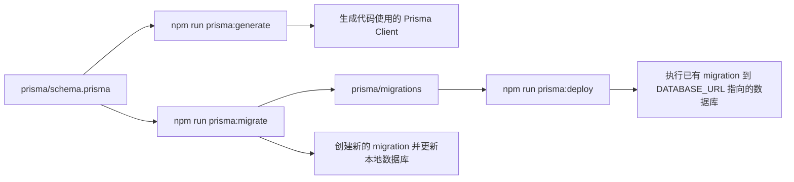

# music-ai-server

NestJS + Prisma + PostgreSQL 后端，用于 AI 音乐生成项目实训。
脚手架使用总入口请先阅读：[../开发脚手架使用指南/00-README.md](../开发脚手架使用指南/00-README.md)

| 能力 | 地址 |
| --- | --- |
| 健康检查 | `GET /health` |
| 歌曲列表 | `GET /api/songs` |
| Mock 生成 | `POST /api/generate/mock` |
| AI 接口 | `GET/POST /api/ai/*` |
| Swagger | `http://localhost:3000/docs` |
| OpenAPI JSON | `http://localhost:3000/docs-json` |

## 快速启动

完整启动后端前，请先安装 PostgreSQL，并创建 `.env` 中 `DATABASE_URL` 指向的数据库。

| 前置项 | 要求 |
| --- | --- |
| PostgreSQL | 先在本机下载安装并启动 PostgreSQL 服务 |
| 数据库 | 创建数据库，例如 `.env.example` 默认连接的 `music_ai` |
| 连接配置 | 复制 `.env.example` 为 `.env` 后，确认 `DATABASE_URL` 的账号、密码、主机、端口和数据库名正确 |

```bash
copy .env.example .env
npm install
npm run prisma:generate
npm run prisma:deploy
npm run start:dev
```

| 脚本 | 用途 |
| --- | --- |
| `npm run start:dev` | 本地开发启动 |
| `npm test` | 运行后端测试 |
| `npm run build` | 构建后端 |
| `npm run prisma:generate` | 生成 Prisma Client，即代码中用于类型安全访问数据库的客户端 |
| `npm run prisma:migrate` | 本地创建或更新 migration |
| `npm run prisma:deploy` | 将已有 migration 应用到 `DATABASE_URL` 指向的数据库 |

## Prisma 的用途

Prisma 用 `prisma/schema.prisma` 描述数据库结构。这个文件是后端代码和 PostgreSQL 表结构之间的中间层：开发者先在 `schema.prisma` 中定义数据模型，再通过 Prisma 命令生成代码客户端或同步数据库结构。

| 文件或命令 | 作用 |
| --- | --- |
| `prisma/schema.prisma` | 定义数据模型、字段、关系和数据库连接方式 |
| `npm run prisma:generate` | 根据 `schema.prisma` 生成 Prisma Client，供后端代码类型安全地访问数据库 |
| `npm run prisma:deploy` | 将 `prisma/migrations` 中已有的数据库变更应用到 `DATABASE_URL` 指向的数据库 |
| `npm run prisma:migrate` | 开发者修改 `schema.prisma` 后，创建新的 migration 并更新本地数据库 |



项目首次启动时，migration 文件已经随项目提交，只需要执行 `npm run prisma:deploy` 应用到自己的 PostgreSQL 数据库。只有在开发者修改 `schema.prisma` 并需要生成新的数据库变更文件时，才使用 `npm run prisma:migrate`。

| 本地 `.env` | 说明 |
| --- | --- |
| `PORT` | 后端端口，默认 `3000` |
| `CORS_ORIGIN` | 允许访问后端的前端地址 |
| `DATABASE_URL` | Prisma 数据库连接，需要指向已创建的 PostgreSQL 数据库 |
| `MINIMAX_API_KEY` | 真实 AI Key，向老师领取 |

PostgreSQL 安装、建库和连接配置可参考 `../开发脚手架使用指南/07-database.md`。如果只临时调试 mock 或 AI 接口，可以不连接数据库；完整启动和数据库相关接口仍需要先完成 PostgreSQL 准备。
